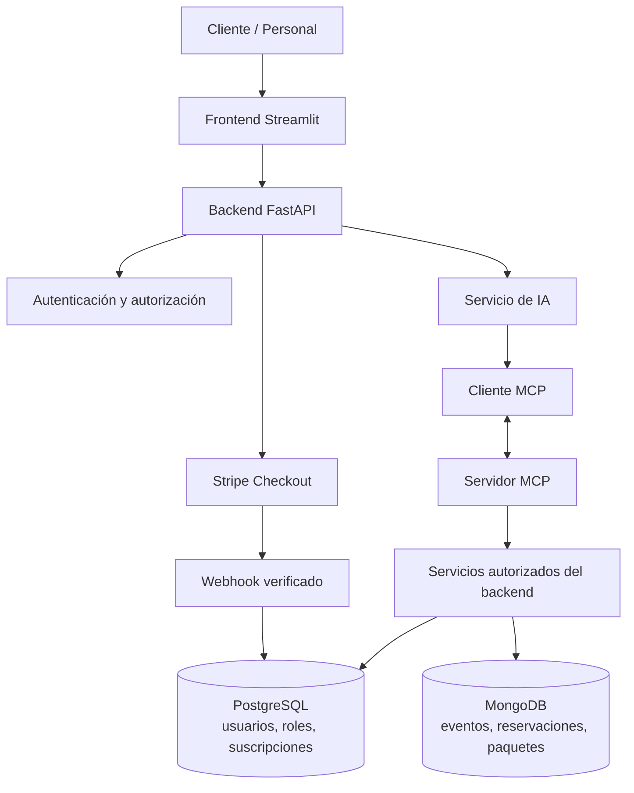

# Arquitectura preliminar

```mermaid
flowchart TD
    U[Cliente / Personal] --> F[Frontend Streamlit]
    F --> B[Backend FastAPI]
    B --> AUTH[Autenticación y autorización]
    B --> AI[Servicio de IA]
    AI --> MCPC[Cliente MCP]
    MCPC <--> MCPS[Servidor MCP]
    MCPS --> S[Servicios autorizados del backend]
    S --> PG[(PostgreSQL\nusuarios, roles, suscripciones)]
    S --> MG[(MongoDB\neventos, reservaciones, paquetes)]
    B --> ST[Stripe Checkout]
    ST --> WH[Webhook verificado]
    WH --> PG
```

El backend autentica al usuario y aplica permisos antes de permitir consultas o modificaciones. La IA no tiene conexión directa a las bases de datos.
